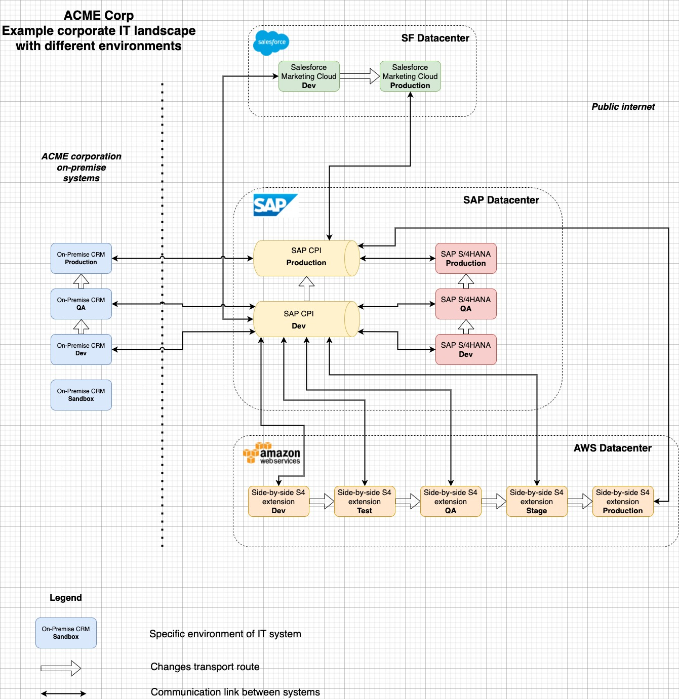
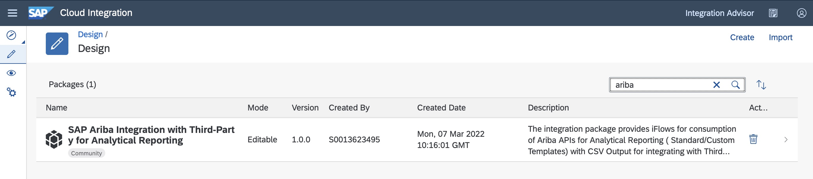
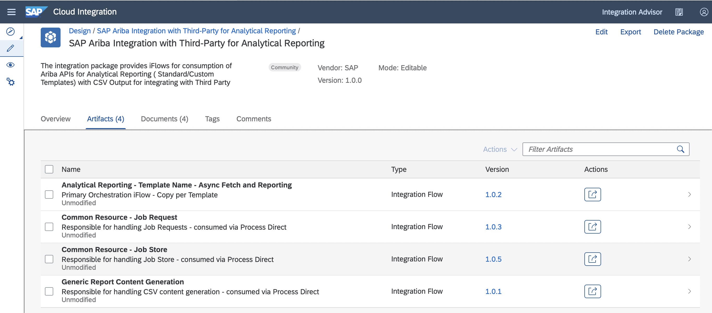
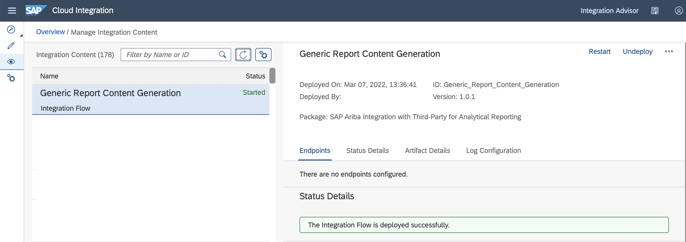
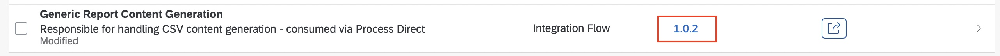

# Landscaper - Transport and CI/CD support for SAP Cloud Integration

## How to have multiple integration landscapes in one CPI tenant 

Standard CPI landscape consists of two systems - dev and prod. Transport system is only capable of transferring integration packages from one tenant to another. Hosting two or more landscapes in one integration tenant is not supported natively by SAP. Therefore this solution helps to overcome this limitation, and have consistent development - test - prod landscape using two(or even one) integration tenant. Actually, multiple variants are supported for those who have heterogenious integration landscape. You can define number of stages and hosting tenants for each integration package. Therefore it is advised to split you developments by integration packages in order to make convenient setup.

Example of heterogeneous corporate landscape:


You can see, that corporate systems can have number of instances more than two, but SAP CPI often is limited by two tenants. Picture illustrates, how you can connect different environments to Dev and Prod CPI tenants using landscaper.

### Quick start

0. Get landscaper


 - Download latest release from [Releases](https://github.com/Trifolium-project/landscaper/releases)
 
 - OR build from source

```bash
git clone git@github.com:Trifolium-project/landscaper.git
```

```bash
./go-executable-build.bash .
```

1. Install landscaper

 - Unpack landscaper.zip
```bash
unzip landscaper.zip
```
 - Move executable to PATH folder. Select appropriate executable, for example for Apple Silicon processors:

```bash
sudo mv build/landscaper-darwin-arm64 /usr/local/bin/landscaper
```


2. Prerequisites


 - Create directory
```bash
mkdir -p  ~/Documents/demo-landscape/conf && cd ~/Documents/demo-landscape
```
 - Add landscape minimal config
```bash
cat <<EOT >> ~/Documents/demo-landscape/conf/landscape.yaml
#Minimal example of landscape declaration
landscape:
  name: Test env
  systems:
    - id: dev
      name: Development Tenant 
      host: xxxxxxx-tmn.hci.ru1.hana.ondemand.com #CHANGE HOST
      login: DEV_LOGIN_ENV_VAR
      password: DEV_PASSWORD_ENV_VAR
  environments:
    - id: Dev
      name: Development Environment
      suffix: null
      system: dev
    - id: QA
      name: QA Environment
      suffix: QA
      system: dev
  originalEnvironment: Dev
EOT
```
 - Add credentials
 
User must have appropriate authorizations in order to access SAP CPI API
```bash
cat <<EOT >> ~/Documents/demo-landscape/.env
DEV_LOGIN_ENV_VAR=S0012345678
DEV_PASSWORD_ENV_VAR=1qazxsw23edcvfr4
EOT
```

3. Use landscaper

 - Copy package from discover to design area

```bash
landscaper package copy --pkg=SAPAribaAnalyticalReportingIntegrationwithThirdParty --env=Dev
```

```bash
===Package metadata===

ID:             SAPAribaAnalyticalReportingIntegrationwithThirdParty
Name:           SAP Ariba Integration with Third-Party for Analytical Reporting
Version:        1.0.0
ShortText:      The integration package provides iFlows for consumption of Ariba APIs for Analytical Reporting ( Standard/Custom Templates) with CSV Output for integrating with Third Party

===Artifact list===

#       ArtefactId                                                              Version Name
1       Common_Resource_-_Job_Request                                           1.0.3   Common Resource - Job Request
2       Common_Resource_-_Job_Store                                             1.0.5   Common Resource - Job Store
3       Analytical_Reporting_-_Template_Name_-_Async_Fetch_and_Reporting        1.0.2   Analytical Reporting - Template Name - Async Fetch and Reporting
4       Generic_Report_Content_Generation                                       1.0.1   Generic Report Content Generation
```

Package in SAP CPI:


Artifacts in package:


 - Deploy artifact

```bash
landscaper artifact deploy --env=Dev --artifact=Generic_Report_Content_Generation
```

```bash
Deploy started...

===Artifact metadata===

ID:             Generic_Report_Content_Generation
Name:           Generic Report Content Generation
Version:        1.0.1
Package:        SAPAribaAnalyticalReportingIntegrationwithThirdParty
```
Deployed artifact:


 - Get artifact data

```bash
landscaper artifact get --env=Dev --artifact=Generic_Report_Content_Generation 
```

```bash
===Artifact metadata===

ID:                     Generic_Report_Content_Generation
Name:                   Generic Report Content Generation
Version:                1.0.1
Package:                SAPAribaAnalyticalReportingIntegrationwithThirdParty
Deploy status:          STARTED
Deployed version:       1.0.1

===Configuration===

Key             Value                                   Type
Endpoint        /OpenAPI/ReportContentGeneration        xsd:string
```

 - Update landscape definition, add configuration for integration flow in QA environment

```bash
cat <<EOT >> ~/Documents/demo-landscape/conf/landscape.yaml
#Minimal example of landscape declaration
landscape:
  name: Test env
  systems:
    - id: dev
      name: Development Tenant 
      host: xxxxxxx-tmn.hci.ru1.hana.ondemand.com #CHANGE HOST
      login: DEV_LOGIN_ENV_VAR
      password: DEV_PASSWORD_ENV_VAR
  packages:
    - id: SAPAribaAnalyticalReportingIntegrationwithThirdParty
      artifacts:
        - id: Generic_Report_Content_Generation
          configurations:
            - environment: QA
              parameters:
                - key: Endpoint
                  value: /QA/OpenAPI/ReportContentGeneration
  environments:
    - id: Dev
      name: Development Environment
      suffix: null
      system: dev
    - id: QA
      name: QA Environment
      suffix: QA
      system: dev
  originalEnvironment: Dev
EOT
```


 - Move package and one of the artifacts to QA env

```bash
landscaper package move --target-env=QA --pkg=SAPAribaAnalyticalReportingIntegrationwithThirdParty --iflow=Generic_Report_Content_Generation
```

```bash
Transporting SAPAribaAnalyticalReportingIntegrationwithThirdParty to QA...
#	ArtefactId				                  Version	Package							                                    Transferred to QA	Deployed
1	Generic_Report_Content_GenerationQA	1.0.1	  SAPAribaAnalyticalReportingIntegrationwithThirdPartyQA	true			false
```

 - Get artifact data in QA

```bash
landscaper artifact get --env=QA --artifact=Generic_Report_Content_GenerationQA 
```

```bash
===Artifact metadata===

ID:		Generic_Report_Content_GenerationQA
Name:		Generic Report Content Generation QA
Version:	1.0.1
Package:	SAPAribaAnalyticalReportingIntegrationwithThirdPartyQA
Deploy status:	Not deployed

===Configuration===

Key       Value					                      Type
Endpoint	/QA/OpenAPI/ReportContentGeneration	xsd:string

```


 - Deploy artifact in QA

```bash 
landscaper artifact deploy --env=QA --artifact=Generic_Report_Content_GenerationQA
```

 - Make some changes in integration flow, save new version




 - Move delta changes to QA env, and deploy immediately


```bash
landscaper package move --pkg=SAPAribaAnalyticalReportingIntegrationwithThirdParty --target-env=QA --iflow=Generic_Report_Content_Generation --deploy
```

```bash
Transporting SAPAribaAnalyticalReportingIntegrationwithThirdParty to QA...
#	ArtefactId				Version	Package							Transferred to QA	Deployed
1	Generic_Report_Content_GenerationQA	1.0.2	SAPAribaAnalyticalReportingIntegrationwithThirdPartyQA	true			true
```

 - Get list of artifacts for package
```bash
landscaper artifact list --pkg=SAPAribaAnalyticalReportingIntegrationwithThirdPartyQA --env=QA
```

```bash
#	ArtefactId				Version	Package							Deploy Status	Deployed Version
1	Generic_Report_Content_GenerationQA	1.0.2	SAPAribaAnalyticalReportingIntegrationwithThirdPartyQA	STARTED		1.0.2

```


### Landscape definition

Landscape YAML file consists of multiple objects and relationships between them. Prior using landscaper CLI tool, you need to define basic parameters of your integration landscape, such as CPI systems, integration packages and flows, configuration and so on. Very basic example of Landscape definition can be found [here](./conf/landscape-example.yaml). 
This example describes Acme Corporation integration landscape, that consists of two SAP CPI systems(Development and Production tenant). Production tenant hosts only productive integration flows, and development tenant hosts Dev and QA integration flows simultaneously. Changes are transported from original environment Dev to QA, and then to Prod. Each environment has its own configuration values, that are stored in landscape definition. No more manual export\import of packages and iflows, the process can be automated with known CI/CD engines, if you embed landscaper in pipeline.  


#### **Landscape** 

**landscape** is a container for other objects.

**landscape** has next parameters:
   - name - free text
   - originalEnvironment - ID of "development" environment, where changes in integration flows are performed. After commiting changes(save as version), you can transport new version of integration flows to other environments(e.g. test and production).

```yaml
landscape:
  name: Acme Corporation integration landscape
  originalEnvironment: Dev
  #Other objects...
```

Also landscape includes several other objects:
 - Array of **systems**
 - Array of **packages**
 - Array of **environments**


#### **System**

Landscape must contain one or more SAP CPI systems, which you will use to develop and deploy integration flows. Multiple options are possible:
 - One system for all environments
This can be used in small setups, where you have only one SAP CPI tenant. In such scenario you have to consider performance of system, because intence processes in non-prod environments can affect production integration flows. For example, dev iflow can hang up the whole tenant, which will have negative consequences for production data exchange. Therefore this setup is not recommended for landscapes with large amount of data exchange.

 - One system for each environment
The most expensive and reliable way, where you separate each landscape physically. There is no influence of environments between each other, so that if process in dev system hang whole tenant, you still have working artifacts in Production

 - Mixed scenario
Often times SAP provides two tenants of Cloud Platform Integration: Development and Production. But many enterprise information systems have 3-tier of even 4-tier landscape. In such a case, it seems natural to have all non-prod artifacts in SAP CPI development tenant, and all production artifacts in SAP CPI production tenant. It can be done by hand with export\import packages and artifacts, add some prefixes and deploy new artifacts as separate landscape. In practise, you often need to make an adjustements in artifacts, and each time you want to move changes from Dev to Test, this leads to monotonous manual process of export\import and reconfiguration. In the end of the day, in the sake of speed you make change directly in Test environment, and forget to move change back to Dev. That is how all the mess starts. Landscaper can help you to avoid this, and have separate environments with automatic transport and configuration process. 

In the provided example, this last mixed scenario is described.

Example definition of two systems is provided below:

```yaml
  systems:
    - id: dev
      name: Development Tenant lxxxxxx
      host: exxxxxx-tmn.hci.xxx.hana.ondemand.com
      login: DEV_LOGIN_ENV_VAR
      password: DEV_PASSWORD_ENV_VAR
    - id: prod
      name: Production Tenant Trial
      host: lxxxxxx-tmn.hci.xxx.hana.ondemand.com
      login: PROD_LOGIN_ENV_VAR
      password: PROD_PASSWORD_ENV_VAR
```

Each system have next parameters:
 - id - unique identificator of the system
 - name - free text
 - host - hostname of the SAP CPI tenant
 - login - environment variable, which contains username(S-user). This user should have an access to Cloud Platform Integration API.
 - password - environment variable, which contains password for provided usernamу

Credentials cannot be set directly in landscape file due to security reasons. Please use environment variables, or [.env](./example.env) file. If credentials are not provided, landscaper will ask username and password for each system in interactive way.

#### **Environment**

Environment is an abstract concept, which represents set of packages, related to a specific system.
Relationship between a system and environments is 1:n, so that system can host many environments, but an environment cannot be spread amongst many systems.

Example definition of three environments is provided below:

```yaml
  environments:
    - id: Dev
      name: Development Environment
      suffix: null
      system: dev
    - id: QA
      name: QA Environment
      suffix: QA
      system: dev
    - id: Prod
      name: Prod Environment
      suffix: null
      system: prod
```

Each system have next parameters:

 - id - unique identificator of the environment
 - name - free text
 - suffix - short set of letters, which is used to separate packages and artifacts from different environments, in case they are hosted in one system. This is only useful, if one system hosts more than one environment.
 - system - id of the system, to which this environemnt is assigned.

If you need to add new environment to your landscape, minimum option is to add new entry in this array. For automatic configuration of iflows you should also consider setting up packages and artifacts in landscape definition.

#### **Package**

Similar to SAP CPI, in landscape definition package is only a container for related integration flows and other artifacts. in fact, there is no need to add package to definition, if you will not add iflows' configurations. In this case, all operations with package transport and artifact list\deploy\undeploy can still be performed. 

Each package have next parameters:

 - id - unique identificator of the package. It should be exactly the same, as you see it in CPI. Make sure, that you entered here ID of the package, and not the description.
 - Array of artifacts 

#### **Artifact**

Now, only integration flows are supported, but it is also planned to add other objects, such as Value Mappings and Script Collections.