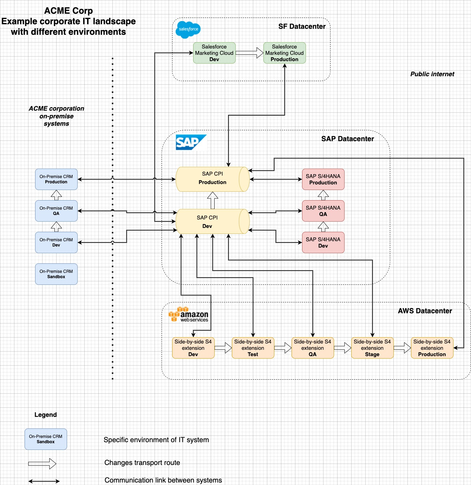
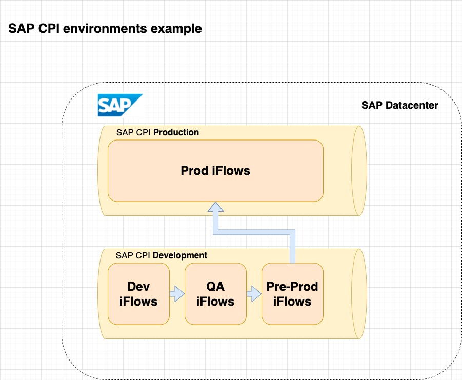
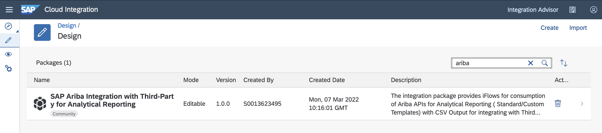
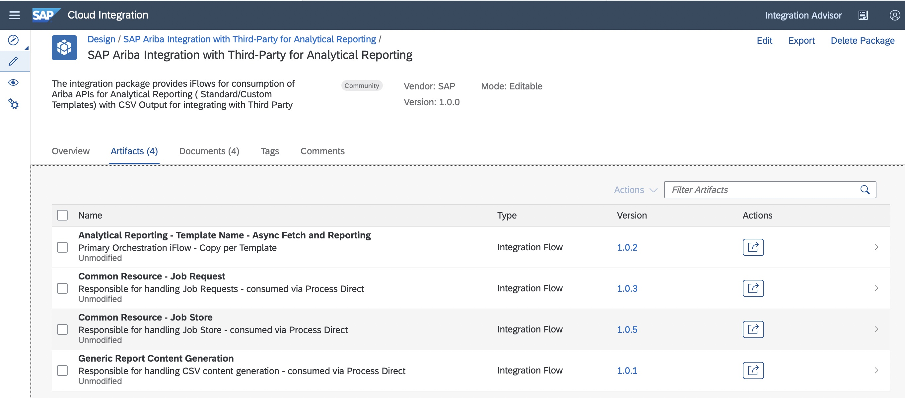
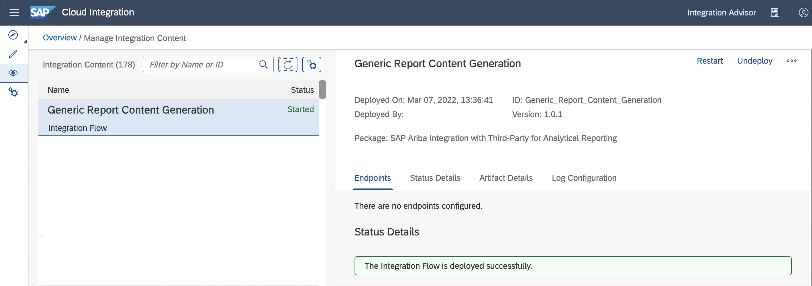
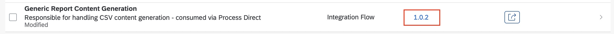
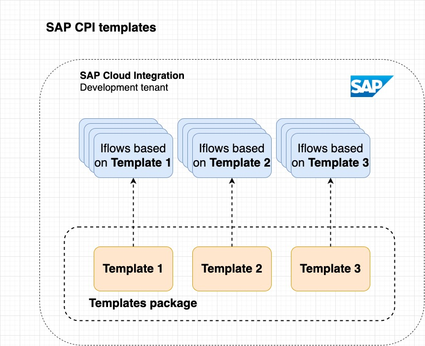
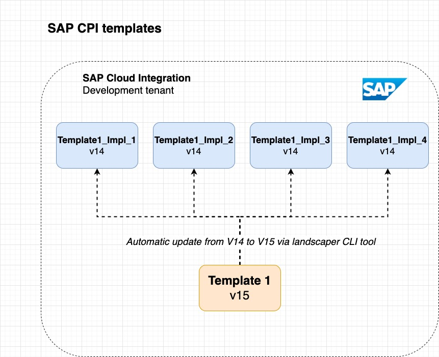

# Landscaper - Transport and CI/CD support for SAP Cloud Integration

## How to have multiple integration landscapes in one CPI tenant 

Standard CPI landscape consists of two systems - dev and prod. Transport system is only capable of transferring integration packages from one tenant to another. Hosting two or more landscapes in one integration tenant is not supported natively by SAP. Therefore this solution helps to overcome this limitation, and have consistent development - test - prod landscape using two(or even one) integration tenant. Actually, multiple variants are supported for those who have heterogenious integration landscape. You can define number of stages and hosting tenants for each integration package. Therefore it is advised to split you developments by integration packages in order to make convenient setup.

Example of heterogeneous corporate landscape:


You can see, that corporate systems can have number of instances more than two, but SAP CPI often is limited by two tenants. Picture illustrates, how you can connect different environments to Dev and Prod CPI tenants using landscaper.

Below you can find zoomed example of CPI landscape. It can contain multiple "environments", for example Dev, QA, Pre-Prod and Prod(on separate system). Transport process is automated, so you can transfer new versions of integration content from Dev to QA, Pre-Prod and Prod very quickly. Overall speed of changes, durability and number of deployments is raised. 



### Quick start

0. Install landscaper

Every [release](https://github.com/Trifolium-project/landscaper/releases) ships
one asset, `landscaper.zip`, holding a static binary for each platform. There is
nothing to compile and no runtime to install - pick your binary out of the
archive, make it executable and put it on your `PATH`.

| Platform | Binary in the archive |
|---|---|
| macOS, Apple Silicon (M1 and later) | `build/landscaper-darwin-arm64` |
| macOS, Intel | `build/landscaper-darwin-amd64` |
| Linux, x86-64 | `build/landscaper-linux-amd64` |
| Linux, ARM64 | `build/landscaper-linux-arm64` |
| Windows, x86-64 | `build/landscaper-windows-amd64.exe` |

Unsure which one? Run `uname -sm` on macOS or Linux: `arm64`/`aarch64` means the
ARM build, `x86_64` means the amd64 one.

**Releases are marked as pre-release, so there is no "latest" download URL** -
`/releases/latest/download/...` returns 404. Install a version by name, or let
the commands below look the newest one up. They read the releases feed rather
than the GitHub API, whose limit of 60 anonymous requests per hour is quickly
used up behind a shared company IP.

<details open>
<summary><b>macOS</b></summary>

```bash
# Newest release, Apple Silicon. Use landscaper-darwin-amd64 on an Intel Mac.
VERSION=$(curl -fsSL https://github.com/Trifolium-project/landscaper/releases.atom | grep -o 'releases/tag/[^"]*' | head -1 | cut -d/ -f3)
curl -fL -o landscaper.zip "https://github.com/Trifolium-project/landscaper/releases/download/${VERSION:?release lookup failed}/landscaper.zip"

unzip -o landscaper.zip
sudo install -m 755 build/landscaper-darwin-arm64 /usr/local/bin/landscaper

landscaper --help
```

On Apple Silicon the binaries are ad-hoc signed and simply run. On an Intel Mac
they are unsigned, so if you downloaded the archive with a **browser** macOS may
refuse to start it with *"cannot be opened because the developer cannot be
verified"*. Clear the quarantine flag and try again:

```bash
sudo xattr -d com.apple.quarantine /usr/local/bin/landscaper
```

Downloading with `curl`, as above, does not set that flag in the first place.

</details>

<details open>
<summary><b>Linux</b></summary>

```bash
# Newest release, x86-64. Use landscaper-linux-arm64 on ARM.
VERSION=$(curl -fsSL https://github.com/Trifolium-project/landscaper/releases.atom | grep -o 'releases/tag/[^"]*' | head -1 | cut -d/ -f3)
curl -fL -o landscaper.zip "https://github.com/Trifolium-project/landscaper/releases/download/${VERSION:?release lookup failed}/landscaper.zip"

unzip -o landscaper.zip
sudo install -m 755 build/landscaper-linux-amd64 /usr/local/bin/landscaper

landscaper --help
```

Without root, install into your own `PATH` instead:

```bash
mkdir -p ~/.local/bin
install -m 755 build/landscaper-linux-amd64 ~/.local/bin/landscaper
export PATH="$HOME/.local/bin:$PATH"   # add to ~/.bashrc to make it permanent
```

</details>

<details open>
<summary><b>Windows (PowerShell)</b></summary>

```powershell
# Newest release
$feed = [xml](Invoke-WebRequest -UseBasicParsing https://github.com/Trifolium-project/landscaper/releases.atom).Content
$version = @($feed.feed.entry)[0].link.href.Split('/')[-1]
Invoke-WebRequest -UseBasicParsing "https://github.com/Trifolium-project/landscaper/releases/download/$version/landscaper.zip" -OutFile landscaper.zip

Expand-Archive landscaper.zip -DestinationPath . -Force
New-Item -ItemType Directory -Force "$env:LOCALAPPDATA\Programs\landscaper" | Out-Null
Copy-Item build\landscaper-windows-amd64.exe "$env:LOCALAPPDATA\Programs\landscaper\landscaper.exe" -Force

# Add to PATH for future sessions
[Environment]::SetEnvironmentVariable(
  "Path",
  [Environment]::GetEnvironmentVariable("Path", "User") + ";$env:LOCALAPPDATA\Programs\landscaper",
  "User")

# Reopen the terminal, then:
landscaper --help
```

</details>

Installing a **specific version** is the same commands with the lookup replaced
by the tag you want, as listed on the
[releases page](https://github.com/Trifolium-project/landscaper/releases):

```bash
curl -fL -o landscaper.zip https://github.com/Trifolium-project/landscaper/releases/download/v0.8.0/landscaper.zip
```

If `unzip` fails with *"End-of-central-directory signature not found"*, the file
is not the archive but an error page saved under its name - check with
`ls -l landscaper.zip` (the archive is about 44 MB) and `head -c 100 landscaper.zip`.
The usual cause is a `/releases/latest/...` URL or an empty version from a failed
lookup; `curl -f`, as above, fails instead of saving the page.

`landscaper` has no self-update and no `--version` flag; to upgrade, repeat the
install and overwrite the binary. To uninstall, delete it - the tool writes
nothing outside the directory you run it in.

 - OR build from source, which needs Go 1.17 or newer:

```bash
git clone git@github.com:Trifolium-project/landscaper.git
cd landscaper
```

```bash
./go-executable-build.bash .          # all platforms, into build/
go build -o landscaper .              # or just this machine
```

1. Prerequisites


 - Create directory
```bash
mkdir -p  ~/Documents/demo-landscape/conf && cd ~/Documents/demo-landscape
```
 - Add landscape minimal config
```bash
cat <<EOT >> ~/Documents/demo-landscape/conf/landscape.yaml
#Minimal example of landscape declaration
landscape:
  name: Test env
  systems:
    - id: dev
      name: Development Tenant 
      host: xxxxxxx-tmn.hci.ru1.hana.ondemand.com #CHANGE HOST
      login: DEV_LOGIN_ENV_VAR
      password: DEV_PASSWORD_ENV_VAR
  environments:
    - id: Dev
      name: Development Environment
      suffix: null
      system: dev
    - id: QA
      name: QA Environment
      suffix: QA
      system: dev
  originalEnvironment: Dev
EOT
```
 - Add credentials
 
User must have appropriate authorizations in order to access SAP CPI API
```bash
cat <<EOT >> ~/Documents/demo-landscape/.env
DEV_LOGIN_ENV_VAR=S0012345678
DEV_PASSWORD_ENV_VAR=1qazxsw23edcvfr4
EOT
```

2. Use landscaper

 - Copy package from discover to design area

```bash
landscaper package copy --id=SAPAribaAnalyticalReportingIntegrationwithThirdParty --env=Dev
```

```bash
===Package metadata===

ID:             SAPAribaAnalyticalReportingIntegrationwithThirdParty
Name:           SAP Ariba Integration with Third-Party for Analytical Reporting
Version:        1.0.0
Mode:           EDIT_ALLOWED
Vendor:         SAP

===Artifact list===

#       ArtefactId                                                              Version Type
1       Common_Resource_-_Job_Request                                           1.0.3   IntegrationFlow
2       Common_Resource_-_Job_Store                                             1.0.5   IntegrationFlow
3       Analytical_Reporting_-_Template_Name_-_Async_Fetch_and_Reporting        1.0.2   IntegrationFlow
4       Generic_Report_Content_Generation                                       1.0.1   IntegrationFlow
```

Package in SAP CPI:


Artifacts in package:


 - Deploy artifact

```bash
landscaper artifact deploy --env=Dev --artifact=Generic_Report_Content_Generation
```

```bash
Deploy started...

===Artifact metadata===

ID:             Generic_Report_Content_Generation
Name:           Generic Report Content Generation
Version:        1.0.1
Package:        SAPAribaAnalyticalReportingIntegrationwithThirdParty
```
Deployed artifact:


 - Get artifact data

```bash
landscaper artifact get --env=Dev --artifact=Generic_Report_Content_Generation 
```

```bash
===Artifact metadata===

ID:                     Generic_Report_Content_Generation
Name:                   Generic Report Content Generation
Version:                1.0.1
Package:                SAPAribaAnalyticalReportingIntegrationwithThirdParty
Deploy status:          STARTED
Deployed version:       1.0.1

===Configuration===

Key             Value                                   Type
Endpoint        /OpenAPI/ReportContentGeneration        xsd:string
```

 - Update landscape definition, add configuration for integration flow in QA environment

```bash
cat <<EOT >> ~/Documents/demo-landscape/conf/landscape.yaml
#Minimal example of landscape declaration
landscape:
  name: Test env
  systems:
    - id: dev
      name: Development Tenant 
      host: xxxxxxx-tmn.hci.ru1.hana.ondemand.com #CHANGE HOST
      login: DEV_LOGIN_ENV_VAR
      password: DEV_PASSWORD_ENV_VAR
  packages:
    - id: SAPAribaAnalyticalReportingIntegrationwithThirdParty
      artifacts:
        - id: Generic_Report_Content_Generation
          configurations:
            - environment: QA
              parameters:
                - key: Endpoint
                  value: /QA/OpenAPI/ReportContentGeneration
  environments:
    - id: Dev
      name: Development Environment
      suffix: null
      system: dev
    - id: QA
      name: QA Environment
      suffix: QA
      system: dev
  originalEnvironment: Dev
EOT
```


 - Move package and one of the artifacts to QA env

```bash
landscaper package move --target-env=QA --pkg=SAPAribaAnalyticalReportingIntegrationwithThirdParty --iflow=Generic_Report_Content_Generation
```

```bash
Transporting SAPAribaAnalyticalReportingIntegrationwithThirdParty to QA...
#	ArtefactId				                  Version	Package							                                    Transferred to QA	Deployed
1	Generic_Report_Content_GenerationQA	1.0.1	  SAPAribaAnalyticalReportingIntegrationwithThirdPartyQA	true			false
```

 - Get artifact data in QA

```bash
landscaper artifact get --env=QA --artifact=Generic_Report_Content_GenerationQA 
```

```bash
===Artifact metadata===

ID:		Generic_Report_Content_GenerationQA
Name:		Generic Report Content Generation QA
Version:	1.0.1
Package:	SAPAribaAnalyticalReportingIntegrationwithThirdPartyQA
Deploy status:	Not deployed

===Configuration===

Key       Value					                      Type
Endpoint	/QA/OpenAPI/ReportContentGeneration	xsd:string

```


 - Deploy artifact in QA

```bash 
landscaper artifact deploy --env=QA --artifact=Generic_Report_Content_GenerationQA
```

 - Make some changes in integration flow, save new version




 - Move delta changes to QA env, and deploy immediately


```bash
landscaper package move --pkg=SAPAribaAnalyticalReportingIntegrationwithThirdParty --target-env=QA --iflow=Generic_Report_Content_Generation --deploy
```

```bash
Transporting SAPAribaAnalyticalReportingIntegrationwithThirdParty to QA...
#	ArtefactId				Version	Package							Transferred to QA	Deployed
1	Generic_Report_Content_GenerationQA	1.0.2	SAPAribaAnalyticalReportingIntegrationwithThirdPartyQA	true			true
```

 - Get list of artifacts for package
```bash
landscaper artifact list --pkg=SAPAribaAnalyticalReportingIntegrationwithThirdPartyQA --env=QA
```

```bash
#	ArtefactId				Version	Package							Deploy Status	Deployed Version
1	Generic_Report_Content_GenerationQA	1.0.2	SAPAribaAnalyticalReportingIntegrationwithThirdPartyQA	STARTED		1.0.2

```


### Checking the deployment result

Deploying tells you that the tenant accepted the request, not that the flow is
running. `--wait` turns that into a checkable result:

```bash
landscaper artifact upload artifacts/Order_API_TEST_HARNESS --target-env QA --deploy --wait
landscaper artifact deploy --artifact Order_API_TEST_HARNESS --wait
landscaper artifact get --artifact Order_API_TEST_HARNESS
```

With `--wait` the upload table gains two columns:

```
#  ArtefactId                 Source  Package                 Uploaded Version  Action   Deployed  Runtime Status  Error
1  TEST_DEPLOY_STATUS_BROKEN  folder  TestHarnessPreparation  1.0.7             created  true      ERROR           GenerationFailed ...
```

and a failed deployment is explained underneath:

```
Deploy error:
GenerationFailed
The generation and build of the artifact were unsuccessful. Please address the issues outlined below and redeploy the artifact.
Generation and build failed for TEST_DEPLOY_STATUS_BROKEN as validation of resource is failed
Script file 'script1.groovy' not found
```

`--timeout` (default `180s`) and `--interval` (default `5s`) control the wait.

#### Exit codes

The commands that report a deployment result exit with a code, so a script does
not have to parse the output:

| Code | Meaning |
|---|---|
| `0` | Deployed and `STARTED` |
| `2` | The deployment failed, the tenant reported `ERROR` |
| `3` | Still `STARTING` when the wait timed out |
| `4` | The artifact is not deployed |
| `1` | Anything else went wrong |

#### JSON output

`artifact get --output json` emits the same information as one document:

```bash
landscaper artifact get --artifact Order_API_TEST_HARNESS --output json
```

```json
{
  "id": "TEST_DEPLOY_STATUS_BROKEN",
  "name": "Deploy status broken fixture",
  "version": "1.0.7",
  "package": "TestHarnessPreparation",
  "runtime": {
    "status": "ERROR",
    "version": "1.0.7",
    "deployedOn": "2026-09-24T09:55:21.348",
    "deployedBy": "sb-...|it!b117912",
    "error": {
      "message": {
        "subsystemName": "CONTENT",
        "subsystemPartName": "CONTENT_DEPLOY",
        "messageId": "GenerationFailed",
        "messageText": ""
      },
      "parameter": ["The generation and build of the artifact were unsuccessful. ..."]
    },
    "errorText": "GenerationFailed\nThe generation and build ...\nScript file 'script1.groovy' not found"
  },
  "configuration": [{"key": "urlPath", "value": "/erp/order", "type": "xsd:string"}]
}
```

`runtime` is `null` when the artifact is not deployed, and `runtime.error` is
`null` when it deployed cleanly. `errorText` is the whole error tree flattened
to lines, which is usually what a caller wants to read or feed back to a
generator; `error` keeps the structure for anything that needs the message id.

This is enough to drive an automated loop - generate a flow, upload it with
`--deploy --wait`, and act on the exit code, reading `errorText` to decide what
to fix.

A caveat worth knowing: immediately after a redeploy the tenant keeps reporting
the **previous** version as `STARTED` for a while. `--wait` therefore only
accepts a runtime status whose version matches the one just uploaded, so a
success is never reported for a deployment that has not happened yet.

### Checking design guidelines

SAP Cloud Integration ships a static analysis of integration flows, the
[design guidelines](https://help.sap.com/docs/integration-suite/sap-integration-suite/design-guidelines):
around forty rules on exception handling, streaming, security and scripting,
each with a severity. `artifact guidelines` runs them through the API, reports
the result per rule, and skips rules an artifact does not follow on purpose.
The guidelines have to be activated for the tenant by an administrator.

```bash
#Run the guidelines and report the result
landscaper artifact guidelines run --env Dev --artifacts Order_API_TEST_HARNESS,GENAI_OrderQuote

#Read the latest result without running again
landscaper artifact guidelines results --env Dev --packages TestHarnessPreparation

#Every artifact of the landscape configuration, failing only on High rules
landscaper artifact guidelines run --env Dev --all-declared --fail-on high --output json
```

Exactly one of `--artifacts`, `--packages` and `--all-declared` selects what to
check. Ids are given without the environment suffix, which the command appends.
`--packages` reads the package from the tenant, so artifacts not declared in the
landscape configuration are checked too.

```
#  ArtefactId              Package                 Version  Status         Not compliant  Skipped  Violations  Declared skips  Error
1  Order_API_TEST_HARNESS  TestHarnessPreparation  1.0.18   not-compliant  6              1        6           1/1

===Order_API_TEST_HARNESS===
#  Rule                                                 Severity  Status         Elements                         Detail
1  STREAM_THE_XML_SLURPER_INPUT_IN_GROOVY_SCRIPTS       High      not-compliant  CallActivity_59,CallActivity_75  You have configured the script to parse the message body using XMLSlurper without streaming
2  HANDLE_EXCEPTIONS                                    High      not-compliant  Process_1                        You have configured the artifact without an exception subprocess
3  CONTINUE_MESSAGE_PROCESSING_EVEN_AFTER_AN_EXCEPTION  Low       skipped        Process_54,Process_70            Skipped: Errors are handled by the caller
...
===Summary===
Environment:                  Dev
Artifacts:                    1
Compliant:                    0
Not compliant:                1
Not finished:                 0
Errors:                       0
Violations (--fail-on low):   6
```

The text output lists only the rules that need attention. `--output json`
carries every rule, compliant and not applicable ones included:

```json
{
  "environment": "Dev",
  "failOn": "low",
  "summary": {"artifacts": 1, "compliant": 0, "notCompliant": 1, "notFinished": 0, "errors": 0, "violations": 6},
  "artifacts": [{
    "id": "Order_API_TEST_HARNESS",
    "package": "TestHarnessPreparation",
    "version": "1.0.18",
    "executionId": "1fb1f92a45e04c5696efc7121ce91062",
    "executionStatus": "FAIL",
    "executionTime": "2026-09-28T07:41:47Z",
    "status": "not-compliant",
    "violations": 6,
    "counts": {"compliant": 19, "not-applicable": 13, "not-compliant": 6, "skipped": 1},
    "declaredSkips": {"declared": 1, "applied": 1, "failures": []},
    "rules": [{
      "id": "STREAM_THE_XML_SLURPER_INPUT_IN_GROOVY_SCRIPTS",
      "name": "Use of XMLSlurper",
      "category": "Scripting Guidelines",
      "severity": "High",
      "applicability": "Applicable",
      "compliance": "Non-Compliant",
      "status": "not-compliant",
      "skipped": false,
      "skipReason": "",
      "skippedBy": "",
      "expected": "Stream the message body to the XMLSlurper by using message.getBody(java.io.Reader.class) ...",
      "actual": "You have configured the script to parse the message body using XMLSlurper without streaming",
      "violatedComponents": [
        {"id": "CallActivity_59", "name": "Build Response"},
        {"id": "CallActivity_75", "name": "Build Delete Response"}
      ],
      "violatedComponentsRaw": "{CallActivity_59=Build Response, CallActivity_75=Build Delete Response}"
    }]
  }]
}
```

A rule's `status` is one of `compliant`, `not-compliant`, `not-applicable` or
`skipped`. An artifact's is `compliant`, `not-compliant`, `not-executed` (never
checked, only from `results`), `not-finished` or `error`. `violatedComponents`
are the ids of the model elements, as the `.iflw` file names them.

#### Exit codes of run and results

| Code | Meaning |
|---|---|
| `0` | Nothing at or above `--fail-on` is violated |
| `7` | A rule at or above `--fail-on` is not compliant and not skipped |
| `3` | An execution did not finish, or an artifact was never checked |
| `1` | Anything else went wrong, e.g. an artifact that does not exist |

`--fail-on` takes `low` (the default, any violation fails), `medium`, `high` or
`none`. An artifact that fails does not stop a batch: it is reported with its
error and the others are still checked.

#### Skipping rules

```bash
landscaper artifact guidelines skip --env Dev --artifacts Order_API_TEST_HARNESS \
  --rule CONTINUE_MESSAGE_PROCESSING_EVEN_AFTER_AN_EXCEPTION --reason "Errors are handled by the caller"
landscaper artifact guidelines unskip --env Dev --artifacts Order_API_TEST_HARNESS \
  --rule CONTINUE_MESSAGE_PROCESSING_EVEN_AFTER_AN_EXCEPTION
```

The tenant records the reason and who skipped, and keeps the skip for later
executions. Both commands are safe to repeat: they report `unchanged` when the
tenant already holds the requested state, and `updated` when an existing skip
gets a new reason. Some rules are essential and cannot be skipped at all.

To keep exceptions in git, declare them in the landscape configuration instead:

```yaml
packages:
  - id: TestHarnessPreparation
    artifacts:
      - id: Order_API_TEST_HARNESS
        guidelineSkips:
          - rule: CONTINUE_MESSAGE_PROCESSING_EVEN_AFTER_AN_EXCEPTION
            reason: Errors are handled by the caller
```

`artifact guidelines run` applies them to every execution (`--no-declared-skips`
turns that off), and `artifact upload --apply-guideline-skips` applies them after
the upload and the configuration, before `--deploy`, with an extra
`Guideline Skips` column in the table. A declared reason replaces one filed by
hand. A skip the tenant refuses - an unknown or essential rule - is reported and
does not fail the command. `init` keeps the declared skips when it regenerates
the `packages:` section.

#### The rule catalogue

```bash
landscaper artifact guidelines rules --env Dev --artifacts Order_API_TEST_HARNESS --output json
```

lists id, name, category and severity of every activated rule. The API offers
no catalogue of its own, so the list is taken from an execution of the given
artifacts, which is run first when there is none.

### Audit log

Every command can record what it did. Logging is **off by default** and enabled
per run with `--log`:

```bash
landscaper artifact upload artifacts/Order_API_TEST_HARNESS --target-env QA --log
```

That writes one file per run, `logs/landscaper-YYYYMMDD-HHMMSS.log`, as JSON
Lines - one JSON object per line. Use `--log-dir` to write somewhere else:

```bash
landscaper package move --target-env QA --log --log-dir /var/log/landscaper
```

Four kinds of record are written:

| `type` | What it is |
|---|---|
| `run` | The command, the parameters it was given, and how it finished |
| `http` | One call to the tenant: method, url, status, duration, headers and bodies |
| `item` | The outcome of one artifact or package, the same status the table prints |
| `log` | A line of ordinary output, including the message of a fatal error |

So the whole run is greppable afterwards:

```bash
#What failed, and what did the tenant say about it?
jq -r 'select(.type=="http" and .status>=400) | "\(.status) \(.url)\n\(.response_body.text)"' logs/landscaper-*.log

#Did the run succeed?
jq -r 'select(.type=="run" and .phase=="end") | .status' logs/landscaper-*.log
```

**Credentials are never written.** `Authorization`, `X-CSRF-Token`, `Cookie` and
`Set-Cookie` are recorded with their value replaced by `<redacted>`, so the log
shows that authentication was sent without showing what was sent. Integration
flow archives are not written either - an uploaded or downloaded artifact is
recorded as a byte count, not as megabytes of base64.

Response bodies are otherwise recorded in full, which is what makes a failed
transport diagnosable after the fact. **The files therefore contain real tenant
data**: `logs/` is gitignored and the files are created mode `0600`.

Two limitations worth knowing:

 - Only integration content calls are recorded. When the landscape uses OAuth (`tokenURL` is set), the token request that precedes every call is made by a separate HTTP client and does not appear, so the log is not a complete network trace.
 - If `--log` is given and the log file cannot be created, the command **fails** instead of running unrecorded.

### Landscape definition

Landscape YAML file consists of multiple objects and relationships between them. Prior using landscaper CLI tool, you need to define basic parameters of your integration landscape, such as CPI systems, integration packages and flows, configuration and so on. Very basic example of Landscape definition can be found [here](./conf/landscape-example.yaml). 
This example describes Acme Corporation integration landscape, that consists of two SAP CPI systems(Development and Production tenant). Production tenant hosts only productive integration flows, and development tenant hosts Dev and QA integration flows simultaneously. Changes are transported from original environment Dev to QA, and then to Prod. Each environment has its own configuration values, that are stored in landscape definition. No more manual export\import of packages and iflows, the process can be automated with known CI/CD engines, if you embed landscaper in pipeline.  


#### **Landscape** 

**landscape** is a container for other objects.

**landscape** has next parameters:
   - name - free text
   - originalEnvironment - ID of "development" environment, where changes in integration flows are performed. After commiting changes(save as version), you can transport new version of integration flows to other environments(e.g. test and production).

```yaml
landscape:
  name: Acme Corporation integration landscape
  originalEnvironment: Dev
  #Other objects...
```

Also landscape includes several other objects:
 - Array of **systems**
 - Array of **packages**
 - Array of **environments**


#### **System**

Landscape must contain one or more SAP CPI systems, which you will use to develop and deploy integration flows. Multiple options are possible:
 - One system for all environments
This can be used in small setups, where you have only one SAP CPI tenant. In such scenario you have to consider performance of system, because intence processes in non-prod environments can affect production integration flows. For example, dev iflow can hang up the whole tenant, which will have negative consequences for production data exchange. Therefore this setup is not recommended for landscapes with large amount of data exchange.

 - One system for each environment
The most expensive and reliable way, where you separate each landscape physically. There is no influence of environments between each other, so that if process in dev system hang whole tenant, you still have working artifacts in Production

 - Mixed scenario
Often times SAP provides two tenants of Cloud Platform Integration: Development and Production. But many enterprise information systems have 3-tier of even 4-tier landscape. In such a case, it seems natural to have all non-prod artifacts in SAP CPI development tenant, and all production artifacts in SAP CPI production tenant. It can be done by hand with export\import packages and artifacts, add some prefixes and deploy new artifacts as separate landscape. In practise, you often need to make an adjustements in artifacts, and each time you want to move changes from Dev to Test, this leads to monotonous manual process of export\import and reconfiguration. In the end of the day, in the sake of speed you make change directly in Test environment, and forget to move change back to Dev. That is how all the mess starts. Landscaper can help you to avoid this, and have separate environments with automatic transport and configuration process. 

In the provided example, this last mixed scenario is described.

Example definition of two systems is provided below:

```yaml
  systems:
    - id: dev
      name: Development Tenant lxxxxxx
      host: exxxxxx-tmn.hci.xxx.hana.ondemand.com
      login: DEV_LOGIN_ENV_VAR
      password: DEV_PASSWORD_ENV_VAR
    - id: prod
      name: Production Tenant Trial
      host: lxxxxxx-tmn.hci.xxx.hana.ondemand.com
      login: PROD_LOGIN_ENV_VAR
      password: PROD_PASSWORD_ENV_VAR
```

Each system have next parameters:
 - id - unique identificator of the system
 - name - free text
 - host - hostname of the SAP CPI tenant
 - login - environment variable, which contains username(S-user). This user should have an access to Cloud Platform Integration API.
 - password - environment variable, which contains password for provided usernamу

Credentials cannot be set directly in landscape file due to security reasons. Please use environment variables, or [.env](./example.env) file. If credentials are not provided, landscaper will ask username and password for each system in interactive way.

#### **Environment**

Environment is an abstract concept, which represents set of packages, related to a specific system.
Relationship between a system and environments is 1:n, so that system can host many environments, but an environment cannot be spread amongst many systems.

Example definition of three environments is provided below:

```yaml
  environments:
    - id: Dev
      name: Development Environment
      suffix: null
      system: dev
    - id: QA
      name: QA Environment
      suffix: QA
      system: dev
    - id: Prod
      name: Prod Environment
      suffix: null
      system: prod
```

Each system have next parameters:

 - id - unique identificator of the environment
 - name - free text
 - suffix - short set of letters, which is used to separate packages and artifacts from different environments, in case they are hosted in one system. This is only useful, if one system hosts more than one environment.
 - system - id of the system, to which this environemnt is assigned.

If you need to add new environment to your landscape, minimum option is to add new entry in this array. For automatic configuration of iflows you should also consider setting up packages and artifacts in landscape definition.

#### **Package**

Similar to SAP CPI, in landscape definition package is only a container for related integration flows and other artifacts. in fact, there is no need to add package to definition, if you will not add iflows' configurations. In this case, all operations with package transport and artifact list\deploy\undeploy can still be performed. 

Each package have next parameters:

 - id - unique identificator of the package. It should be exactly the same, as you see it in CPI. Make sure, that you entered here ID of the package, and not the description.
 - Array of artifacts 

#### **Artifact**


Now, only integration flows are supported, but it is also planned to add other objects, such as Value Mappings and Script Collections.


You need to add artifact information, if it is necessary to maintain different configuration for each environment. For example, you may need to maintain different endpoints to external systems and credential aliases for each environment. Keep in mind, that all configuration parameters, that are not mentioned in landscape.yaml file, value from original environment will be copied. This means, that you can omit all parameters, that are not changing between environments, in landscape.yaml. This will help to keep configuration file clean.

An artifact may also list `guidelineSkips`, design guideline rules it does not
follow on purpose, each with a `rule` and a mandatory `reason`. See
[Checking design guidelines](#checking-design-guidelines).

#### **Gathering the landscape definition automatically**

Writing packages, artifacts and their parameters by hand is tedious for a grown tenant. The **init** command does it for you.

Prepare a landscape file with systems, environments and originalEnvironment only - see `conf/landscape-minimal-example.yaml` - and run:

```bash
landscaper init
```

Landscaper connects to every system of the landscape, reads its packages, the artifacts of every package and the configuration parameters of every artifact, and writes the `packages` section into `conf/landscape-generated.yaml`. Systems, environments and comments of the source file are kept as they are.

Only the parameters, that differ from the original environment, are written for the other environments, exactly as it is expected of a hand written landscape file. The original environment itself is written completely, as a baseline.

Parameters, that SAP CPI does not allow to change, are left out. By default this is `SAP_ProfileId`, which SAP maintains itself out of the integration profile of the iflow, and which cannot be applied back to a tenant. If an artifact has no other parameters, it is not written at all, so that the file stays readable. Use `--skip-parameters` to change the list.

If several environments are hosted in one system, they are separated by their suffix. Package `SalesforceIntegration` and package `SalesforceIntegrationQA` of the same tenant are recognized as the Dev and the QA copy of one package, and end up in one declaration with a configuration per environment. The same happens across systems, so one package, that lives in a development and in a production tenant, may collect four configurations - for example Dev, QA, PreProd and Prod. A package is only treated as a copy, if the package without suffix exists in the same tenant, so a package, whose name just happens to end with `QA`, is left alone.

Options:

```bash
#Gather only selected packages. Ids are given without environment suffix
landscaper init --packages=SalesforceIntegration,CRMIntegrationPackage

#Update the landscape file itself instead of writing a new one
landscaper init --in-place

#Write another file
landscaper init --output=conf/landscape-new.yaml

#Write all parameters of every environment, not only the differences
landscaper init --all-parameters

#Include packages, that are delivered by SAP and cannot be changed
landscaper init --include-readonly

#Leave out the whole reserved SAP_ namespace, and not only SAP_ProfileId.
#A trailing asterisk matches a prefix
landscaper init --skip-parameters=SAP_*

#Leave out own parameters as well
landscaper init --skip-parameters=SAP_ProfileId,Timeout

#Write all parameters, including the non changeable ones
landscaper init --skip-parameters=
```

The `template` attribute of artifacts is not filled, because there is no way to derive it from the tenant. Add it manually after the file is generated.


## Working with packages

### Listing packages

```bash
landscaper package list --env Dev
```

prints the id of every package in the Design section of the environment's tenant.

### Copying a package from Discover

`package copy` copies a package of the SAP Business Accelerator Hub from the
Discover section into Design:

```bash
landscaper package copy --id SAPERPMasterDataIntegrationWithSAPS4HANACloud --env Dev --output json
```

```json
{
  "source": "SAPERPMasterDataIntegrationWithSAPS4HANACloud",
  "id": "SAPERPMasterDataIntegrationWithSAPS4HANACloud",
  "name": "SAP ERP Master Data Integration with SAP S/4HANA Cloud",
  "mode": "EDIT_ALLOWED",
  "vendor": "SAP",
  "version": "1.0.0",
  "importMode": "",
  "status": "copied",
  "artifacts": [
    {"id": "Create_or_Change_Equipment_from_SAP_ERP_to_SAP_S4HANA_Cloud", "version": "1.0.0", "type": "IntegrationFlow"}
  ]
}
```

`--id` is the technical name the Hub shows in the package URL. It is used as it
is: unlike the global `--pkg`, which is still accepted as an alias, it never
receives the environment suffix. `id` in the result is the package that was
actually created in Design, which is what a later `package delete` should target.

A package that is already in Design is not touched. The tenant refuses the copy
and the command exits with `5`, unless `--import-mode` says what to do:

| `--import-mode` | Effect |
|---|---|
| `overwrite` | Replace the package in Design |
| `overwrite-merge` | Replace it, keeping the configuration of its artifacts |
| `create-copy` | Create another copy. `--suffix LSC` creates `<id>.LSC`, with `.LSC` added to the artifact ids as well |

| Exit code | Meaning |
|---|---|
| `0` | Copied |
| `5` | Already in Design and no `--import-mode` given |
| `6` | Not in Discover, including a custom package that exists only in Design |
| `1` | Anything else |

### Downloading SAP content

Once copied, an SAP package downloads like any other:

```bash
landscaper artifact download --packages SAPERPMasterDataIntegrationWithSAPS4HANACloud --env Dev --output refs/sap
```

This works for **editable** (`EDIT_ALLOWED`) SAP packages, which are most of the
Hub. SAP does not hand out the content of **configure-only** (`READ_ONLY`)
packages; the tenant answers "Cannot download the artifact from a configure
only package". For such a package `artifact download` asks for no content,
reports every artifact as `not downloadable (configure-only SAP package)` and
exits with `7`, so a caller can tell it apart from a failure (`1`).
`--download-all` keeps skipping configure-only packages with a warning.

`--packages` appends the suffix of `--env`, so download copied SAP packages from
an environment without suffix.

### Deleting a package

```bash
landscaper package delete --pkg SAPERPMasterDataIntegrationWithSAPS4HANACloud --env Dev --yes
```

deletes the package with all its artifacts: integration flows, value mappings,
script collections and message mappings. A package declared in the landscape
configuration gets the suffix of `--env`, any other id is used as it is.

Several guards come before the deletion:

 - **Deployed content.** The tenant would delete the package and leave its deployed content running without a design time. The command refuses (exit `5`) and lists what is deployed; `--undeploy` undeploys it first and waits until the runtime no longer holds it.
 - **Managed packages.** A package declared in the landscape configuration is refused (exit `6`) unless `--force` is given, because the landscape would point to nothing afterwards.
 - **Confirmation.** In a terminal the command asks. Without one, `--yes` is required, so a pipeline never hangs on a question.
 - **`--dry-run`** reports the package, its artifacts and their deployed state, and writes nothing.

The tenant deletes in the background, so the command waits (`--timeout`,
`--interval`) until the package is really gone before reporting success.

```json
{
  "id": "PrivateLinkProxy",
  "env": "Dev",
  "deleted": true,
  "dryRun": false,
  "status": "deleted",
  "artifacts": [
    {"id": "AzureBlobConnectivityPrivateLinkServiceSample", "type": "IntegrationFlow", "version": "1.0.0", "deployed": true}
  ],
  "undeployed": ["AzureBlobConnectivityPrivateLinkServiceSample"]
}
```

| Exit code | Meaning |
|---|---|
| `0` | Deleted, or `--dry-run` |
| `4` | The package does not exist |
| `5` | Content is deployed and no `--undeploy` given |
| `6` | Declared in the landscape configuration and no `--force` given |
| `1` | Anything else, including a declined confirmation |

With `--log`, the audit log gets one `item` record per artifact removed or
undeployed.

### Reference downloads: copy, download, delete

A tool that learns from SAP standard content can leave the tenant as it found
it. Only a package the copy itself created is deleted; one that was already in
Design makes the copy exit `5` and is left alone:

```bash
id=$(landscaper package copy --id PrivateLinkProxy --env Dev --output json | jq -r 'select(.status=="copied") | .id')
if [ -n "$id" ]; then
  landscaper artifact download --packages "$id" --env Dev --output refs/sap   #7: configure only
  landscaper package delete --pkg "$id" --env Dev --yes --output json
fi
```

## How to deploy from a git repository to a tenant

The commands above move content from one tenant to another. **pack** and **upload** go the other way round - they take an integration flow out of the local git repository and put it into a tenant. This is what a merge request pipeline needs.

An integration flow is stored in the repository as an exploded folder, exactly as SAP Cloud Integration exports it:

```
artifacts/Order_API_TEST_HARNESS
├── .project
├── metainfo.prop
├── META-INF
│   └── MANIFEST.MF
└── src/main/resources
    ├── parameters.prop
    ├── parameters.propdef
    ├── mapping/map.mmap
    ├── script/script1.groovy
    ├── xsd/order.xsd
    └── scenarioflows/integrationflow/Sample API.iflw
```

### Packing an artifact

```bash
landscaper artifact pack artifacts/Order_API_TEST_HARNESS
```

The archive is named after the folder and holds every file inside it, with `META-INF/MANIFEST.MF` at the archive root. It is written to `build/` unless `--output` says otherwise.

The version of an artifact is the `Bundle-Version` of its `META-INF/MANIFEST.MF`. SAP Cloud Integration refuses content, whose version is already in the tenant, so before packing, landscaper reads the version of the same artifact in the original environment and compares it with the local one:

 - the local version is higher - the artifact is packed right away
 - the artifact is not in the tenant yet - the artifact is packed right away
 - the local version is equal or lower - a new version is requested, written into `META-INF/MANIFEST.MF` and only then packed

```bash
landscaper artifact pack artifacts/Order_API_TEST_HARNESS
```

```bash
Artifact Order_API_TEST_HARNESS is at version 1.0.3 in environment Dev, the local version is 1.0.3.
Please enter a new version [1.0.4]:
#	ArtefactId		Version in Dev	Local Version	Packed Version	Changed	Archive
1	Order_API_TEST_HARNESS	1.0.3		1.0.3		1.0.4		true	build/Order_API_TEST_HARNESS.zip
```

The new version stays in the working tree, so it can be committed together with the change itself. Only the `Bundle-Version` line of the manifest is touched, the rest of the file is kept byte for byte.

Several artifacts can be packed at once, and the check can be skipped:

```bash
landscaper artifact pack artifacts/Order_API_TEST_HARNESS artifacts/Sample_API

#Do not look into the tenant at all
landscaper artifact pack artifacts/Order_API_TEST_HARNESS --skip-version-check

#Write the archives somewhere else
landscaper artifact pack artifacts/Order_API_TEST_HARNESS --output=target
```

A pipeline has no terminal to ask, so the version can be given in advance. Without one of these three flags the command stops with an error instead of waiting for an answer nobody will type:

```bash
#Raise the version above the one in the tenant automatically
landscaper artifact pack artifacts/Order_API_TEST_HARNESS --bump=patch
landscaper artifact pack artifacts/Order_API_TEST_HARNESS --bump=minor
landscaper artifact pack artifacts/Order_API_TEST_HARNESS --bump=major

#Set an exact version. It has to be higher than the one in the tenant
landscaper artifact pack artifacts/Order_API_TEST_HARNESS --set-version=2.0.0
```

The version is always raised relative to the **tenant**, not to the local copy, so `--bump=patch` against a tenant at `1.0.3` gives `1.0.4` regardless of how far the repository has fallen behind.

All of the above describes packing for the **original environment**, which is the one that owns the version. With `--target-env` the artifact is packed for another environment instead:

```bash
landscaper artifact pack artifacts/Order_API_TEST_HARNESS --target-env=QA
```

```bash
#	ArtefactId			Version in QA	Local Version	Packed Version	Changed	Archive
1	Order_API_TEST_HARNESSQA	1.0.4		1.0.5		1.0.5		false	build/Order_API_TEST_HARNESSQA.zip
```

Then the version is taken from the repository exactly as it is, `META-INF/MANIFEST.MF` is never written, and `--bump` and `--set-version` are ignored with a warning. If the version is not higher than the one already in that environment, a warning is printed and the artifact is packed anyway.

`Bundle-SymbolicName` and `Bundle-Name` receive the environment suffix **inside the archive**, and the archive is named after the suffixed id:

```bash
unzip -p build/Order_API_TEST_HARNESSQA.zip META-INF/MANIFEST.MF | grep Bundle-
```

```bash
Bundle-Name: Order API for Test Harness QA
Bundle-SymbolicName: Order_API_TEST_HARNESSQA; singleton:=true
Bundle-Version: 1.0.5
```

This is required, not cosmetic. SAP Cloud Integration derives the symbolic name of an artifact from the id it was created under, so an archive uploaded as `Order_API_TEST_HARNESSQA` that still says `Order_API_TEST_HARNESS` inside is rejected on the next update with *"Could not update artifact of the package; due to change in the Bundle-symbolicName"*. The rename happens in the archive only - the repository is never modified, and `Origin-Bundle-Name` and `Origin-Bundle-SymbolicName` keep the original values.

### Uploading an artifact

```bash
landscaper artifact upload artifacts/Order_API_TEST_HARNESS --target-env=QA --deploy
```

```bash
Uploading 1 artifact(s) to QA...
#	ArtefactId			Source	Package				Version in QA	Uploaded Version	Action	Deployed
1	Order_API_TEST_HARNESSQA	folder	TestHarnessPreparationQA	1.0.3		1.0.4			updated	true
```

An argument is either a folder, which is packed first with the logic described above, or a ready zip archive. Both can be mixed in one call:

```bash
landscaper artifact upload artifacts/Order_API_TEST_HARNESS build/Sample_API.zip --target-env=QA
```

The target package is taken from the landscape definition - the package, that declares the artifact - and, together with the artifact id and name, receives the suffix of the target environment, exactly as **package move** does it. Upload to `QA` therefore puts `Order_API_TEST_HARNESSQA` into `TestHarnessPreparationQA`. The package is created, if it is not in the tenant yet. Use `--pkg` to name the target package explicitly, if an artifact is not declared in the landscape file.

After the upload the configuration parameters, that the landscape definition declares for the target environment, are applied to the artifact. An artifact, that already exists, is updated in place, so its history and its configuration are kept - it is not deleted and created again.

Whenever the target environment has a suffix, the identifiers inside the archive are suffixed too, exactly as described for `artifact pack --target-env` above. A ready `.zip` given on the command line is rewritten the same way before it is sent, so it does not matter whether it was packed for another environment.

**Who owns the version** depends on where the content goes:

 - **the original environment** - the repository owns it. The version is checked against the tenant, `--bump` and `--set-version` apply, and a raised version is written back into `META-INF/MANIFEST.MF` so it can be committed
 - **any other environment** - the repository states it. The version is uploaded exactly as it stands in `META-INF/MANIFEST.MF`, nothing is ever written back, and `--bump` and `--set-version` are ignored with a warning. If the version is not higher than the one already in the target, a warning goes to stdout and the upload proceeds

This is what makes the command safe in a merge request pipeline: a deployment to `QA` can never modify the working tree, so it cannot produce a commit the pipeline did not intend.

```bash
#Upload without looking at the versions in the tenant at all
landscaper artifact upload artifacts/Order_API_TEST_HARNESS --target-env=QA --skip-version-check

#Deploy to QA, as a pipeline would do it. The version comes from the repository
landscaper artifact upload artifacts/Order_API_TEST_HARNESS --target-env=QA --deploy

#Raise the version in the repository and deploy to the original environment
landscaper artifact upload artifacts/Order_API_TEST_HARNESS --target-env=Dev --bump=patch --deploy
```

Both commands exit with a non zero code on the first failure, and report what has already been done, so a pipeline stops on the first broken artifact.

Note, that `--env` is not needed for an upload. It selects the *source* environment and landscaper appends its suffix to `--pkg`, so passing both `--env` and `--target-env` would suffix the package twice.


## How to work with templates in SAP CPI (beta)

### Problem statement

There is a frequent demand to have so called "template" integration flows, which developer can copy and then configure in nessessary way for specific integration. This can be achieved in SAP Cloud Integration by creating separate package for templates, create multiple template iflows for your needs, and then copy them on demand.

Diagram of template approach:


Above approach works well until you need to change something in the template. It is basic desire to have the changes populated to the specific implementations of each template, but for now this task is hardly achievable and involves tedious manual work:
  - Save configurations of target iflow
  - Delete target iflow
  - Copy template to target iflow
  - Configure and deploy

Of course these steps should be multiplied by the number of iflows, which are created from the template, which very quickly becomes nigtmare.


### Solution

Thanks to the SAP Cloud Integration API the steps above can be automated. The process itself is very similar to the **package move** command of landscaper, because the idea is the same - update version of the integration flow and preserve it's configuration, but there are some differences.


Diagram of template update approach:


Configuration for template-based integration flows in **landscape.yaml** should have additional parameter - **template**:


```yaml
#Minimal example of landscape declaration with templates
landscape:
  name: Test env
  systems:
    - id: dev
      name: Development Tenant 
      host: xxxxxxx-tmn.hci.ru1.hana.ondemand.com
      login: DEV_LOGIN_ENV_VAR
      password: DEV_PASSWORD_ENV_VAR
  packages:
    - id: PackageWithTemplateBasedIflows
      artifacts:
        - id: Template1_impl
          template: Template1 #<<<====This parameter
          configurations:
            - environment: QA
              parameters:
                - key: Endpoint
                  value: /qa/iflow1
    - id: AnotherPackageWithTemplateBasedIflows
      artifacts:
        - id: Template1_impl2
          template: Template1 #<<<====This parameter
          configurations:
            - environment: QA
              parameters:
                - key: Endpoint
                  value: /qa/iflow2  
  environments:
    - id: Dev
      name: Development Environment
      suffix: null
      system: dev
    - id: QA
      name: QA Environment
      suffix: QA
      system: dev
  originalEnvironment: Dev
```

This is the only configuration, which you need to add in order to support template updates. After that you can change your template integration flow, save it as a version, and run new command for iflow upgrade:

```bash
landscaper artifact upgrade --template=Template1 
```

This command will perform checks and update all implementations of the selected template. Resulting list contains list of upgraded iflows.
```bash
#       ArtefactId       Version Package                         Upgraded        Deployed
1       Template1_impl   1.0.15  TemplateImplementation          true            false
2       Template1_impl2  1.0.15  TemplateImplementation          true            false
```

As a result, you have upgraded version of your integration flows with the same configuration as before.

*In order to run above command you should have landscaper installed, and be familliar with landscape.yaml definition. Please refer [quick start](#quick-start).*